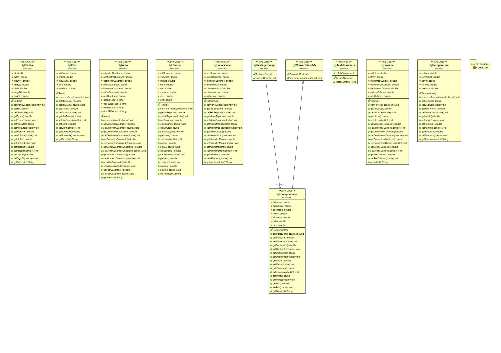
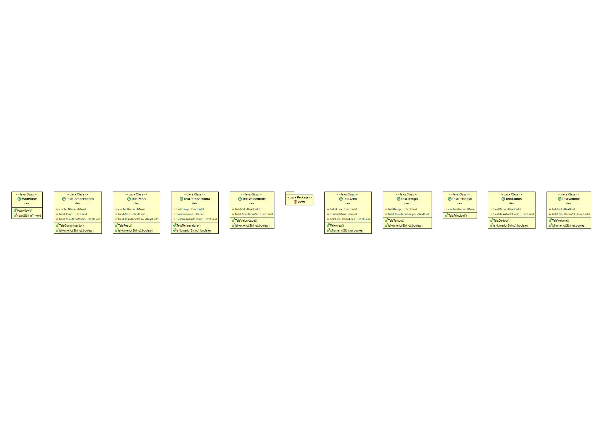

# Diagrama de Classes

O diagrama de classes é um dos principais diagramas da UML (Unified Modeling Language) e é utilizado para representar a estrutura estática de um sistema orientado a objetos. Ele descreve as classes, seus atributos, métodos e os relacionamentos entre elas.
Por meio do diagrama de classes, é possível entender como os elementos do sistema estão organizados, como se comunicam entre si e como as responsabilidades estão distribuídas.

# Versão 0.1

# Versão 0.2

## Versionamentos

|    Data    | Versão |      Descrição       |     Autor      |
| :--------: | :----: | :------------------: | :------------: |
| 08/05/2025 |  0.1   | Criação do documento | Bruno Oliveira |
| 26/05/2025 |  0.2   | Adicionando introdução | Bruno Oliveira |
